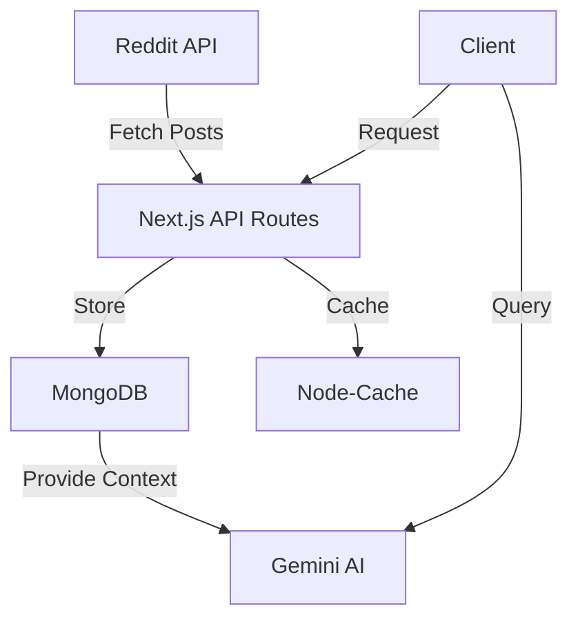

# Product Requirements Document (PRD) - Reddit Community Trend Analyzer with AI Chat (Free Tier)

## Overview
This document outlines the requirements for building a Reddit community trend analyzer with AI chat capabilities using only free services and tools. The application will help users understand trending topics in specific Reddit communities through data analysis and an AI chatbot interface.

---

## 1. Objective
Create a web application that:
- Collects and analyzes Reddit community data
- Shows daily trends and sentiment
- Provides an AI chatbot to answer questions about community trends
All using free-tier services and beginner-friendly technologies.

---

## 2. Core Features & Free Implementation

### 2.1 Authentication
- **Service**: Google OAuth (free)
- **Implementation**: Next-Auth with Google provider
- **Storage**: MongoDB (free tier) for user data

### 2.2 Data Pipeline
#### Reddit Data Collection
- **Service**: Reddit API (free)
- **Tool**: Snoowrap (Reddit API wrapper)
- **Storage**: MongoDB Atlas (free tier - 512MB)
- **Frequency**: Every 6 hours (to stay within free limits)

#### Data Structure
```typescript
// Post Schema
interface RedditPost {
  id: string;
  title: string;
  content: string;
  author: string;
  created: Date;
  media: string[];
  sentiment: 'positive' | 'neutral' | 'negative';
  topics: string[];
}
```

### 2.3 Trend Analysis
#### Simple Implementation
- Basic keyword extraction from titles
- Simple sentiment analysis using keyword matching
- Media URL storage (no processing)

#### Storage Format
```typescript
interface TrendData {
  date: string;
  topics: {
    name: string;
    count: number;
    sentiment: {
      positive: number;
      neutral: number;
      negative: number;
    };
    posts: string[]; // Post IDs
  }[];
}
```

### 2.4 AI Chat Interface
- **Service**: Google Gemini API (free tier)
- **Implementation**: Simple prompt-based responses
- **Context**: Last 24 hours of processed data

### 2.5 Caching Strategy (Free Alternative)
- **Client-side**: React Query + LocalStorage
- **Server-side**: In-memory caching with Node-Cache
- **Cache Duration**: 
  - API responses: 1 hour
  - Processed trends: 6 hours

---

## 3. Technical Stack (All Free)

### 3.1 Core Technologies
```bash
# Create Next.js project
npx create-next-app@latest reddit-trends --typescript --tailwind

# Essential packages
npm install next-auth @google/generative-ai snoowrap
npm install @tanstack/react-query zustand axios
npm install mongoose node-cache
npm install react-loading-skeleton react-icons
npm install @headlessui/react @heroicons/react
```

### 3.2 Free Services Required
1. **Hosting**: Vercel (Free Tier)
2. **Database**: MongoDB Atlas (Free Tier)
3. **Authentication**: Google OAuth
4. **AI**: Google Gemini API
5. **Version Control**: GitHub

### 3.3 Environment Setup
```bash
# .env.local
# Authentication
GOOGLE_CLIENT_ID=your_google_client_id
GOOGLE_CLIENT_SECRET=your_google_client_secret
NEXTAUTH_URL=http://localhost:3000
NEXTAUTH_SECRET=your_random_string

# Database
MONGODB_URI=your_mongodb_uri

# Reddit API
REDDIT_CLIENT_ID=your_reddit_client_id
REDDIT_CLIENT_SECRET=your_reddit_client_secret
REDDIT_USERNAME=your_reddit_username
REDDIT_PASSWORD=your_reddit_password

# AI
GOOGLE_AI_API_KEY=your_gemini_api_key
```


## 4. Architecture & Implementation

### 4.1 Project Structure
```typescript
reddit-trends/
├── src/
│   ├── app/
│   │   ├── api/
│   │   │   ├── auth/
│   │   │   ├── reddit/
│   │   │   └── chat/
│   │   ├── page.tsx
│   │   └── layout.tsx
│   ├── components/
│   │   ├── auth/
│   │   ├── trends/
│   │   └── chat/
│   ├── lib/
│   │   ├── mongodb/
│   │   ├── reddit/
│   │   └── ai/
│   └── utils/
└── public/
```

### 4.2 Data Flow Architecture


### 4.3 Core Components Implementation

#### A. Reddit Data Fetcher
```typescript:src/lib/reddit/fetcher.ts
import snoowrap from 'snoowrap';
import { cache } from '../cache';

export async function fetchSubredditData(subreddit: string) {
  const cacheKey = `subreddit:${subreddit}`;
  
  // Check cache first
  const cachedData = cache.get(cacheKey);
  if (cachedData) return cachedData;

  // Fetch new data
  const reddit = new snoowrap({
    userAgent: 'TrendAnalyzer/1.0',
    clientId: process.env.REDDIT_CLIENT_ID,
    clientSecret: process.env.REDDIT_CLIENT_SECRET,
    username: process.env.REDDIT_USERNAME,
    password: process.env.REDDIT_PASSWORD,
  });

  const posts = await reddit.getSubreddit(subreddit)
    .getHot({ limit: 100 });
    
  // Cache for 1 hour
  cache.set(cacheKey, posts, 3600);
  
  return posts;
}
```

#### B. Simple Sentiment Analyzer
```typescript:src/lib/analysis/sentiment.ts
export function analyzeSentiment(text: string) {
  const positiveWords = ['good', 'great', 'awesome', 'excellent', 'happy'];
  const negativeWords = ['bad', 'poor', 'terrible', 'awful', 'sad'];
  
  const words = text.toLowerCase().split(' ');
  let positive = 0, negative = 0;
  
  words.forEach(word => {
    if (positiveWords.includes(word)) positive++;
    if (negativeWords.includes(word)) negative++;
  });
  
  if (positive > negative) return 'positive';
  if (negative > positive) return 'negative';
  return 'neutral';
}
```

#### C. Topic Extractor
```typescript:src/lib/analysis/topics.ts
export function extractTopics(posts: RedditPost[]) {
  const topics = new Map<string, number>();
  
  posts.forEach(post => {
    const words = post.title
      .toLowerCase()
      .split(' ')
      .filter(word => word.length > 5);
      
    words.forEach(word => {
      topics.set(word, (topics.get(word) || 0) + 1);
    });
  });
  
  return Array.from(topics.entries())
    .sort((a, b) => b[1] - a[1])
    .slice(0, 10);
}
```

### 4.4 Error Handling Strategy
```typescript:src/lib/errors/handler.ts
export const errorHandler = {
  api: async (promise: Promise<any>) => {
    try {
      const data = await promise;
      return [data, null];
    } catch (error) {
      console.error('API Error:', error);
      return [null, error];
    }
  },
  
  ui: (error: Error) => ({
    title: 'Something went wrong',
    message: error.message || 'Please try again later',
    action: () => window.location.reload(),
  })
};
```

## 5. Implementation Steps

### Phase 1: Setup (Week 1)
1. Initialize Next.js project with TypeScript
2. Set up MongoDB connection
3. Implement Google OAuth
4. Create basic UI components

### Phase 2: Reddit Integration (Week 2)
1. Set up Reddit API connection
2. Implement data fetching
3. Create basic caching system
4. Store posts in MongoDB

### Phase 3: Analysis (Week 2-3)
1. Implement basic sentiment analysis
2. Create topic extraction
3. Build trending topics display
4. Add media handling

### Phase 4: AI Integration (Week 3-4)
1. Set up Gemini AI connection
2. Create chat interface
3. Implement context-aware responses
4. Add error handling

## 6. Deployment Guidelines

### 6.1 Vercel Deployment
1. Push code to GitHub
2. Connect repository to Vercel
3. Configure environment variables
4. Deploy

### 6.2 MongoDB Atlas Setup
1. Create free cluster
2. Set up database user
3. Whitelist IP addresses
4. Get connection string

### 6.3 Environment Variables
1. Copy all variables from `.env.local`
2. Add to Vercel project settings
3. Configure Google OAuth redirect URIs
4. Update Reddit API settings

## 7. Free Tier Limitations & Solutions

### 7.1 MongoDB Atlas (512MB limit)
- Implement data cleanup every 48 hours
- Store only essential fields
- Use efficient indexing

### 7.2 Vercel (Serverless Functions)
- Optimize function execution time
- Implement efficient caching
- Use edge functions where possible

### 7.3 Reddit API
- Respect rate limits
- Implement exponential backoff
- Cache responses effectively

### 7.4 Gemini AI
- Monitor token usage
- Implement request limiting
- Cache common responses

## 8. Maintenance & Monitoring

### 8.1 Regular Tasks
- Monitor MongoDB storage usage
- Check API rate limits
- Update npm packages
- Review error logs

### 8.2 Performance Monitoring
- Use Vercel Analytics (free tier)
- Monitor API response times
- Track cache hit rates

## 9. Future Improvements
1. Add more sophisticated sentiment analysis
2. Implement better topic clustering
3. Add user preferences
4. Enhance AI response quality
5. Add data visualization

---

## Appendix

### Useful Resources
1. [Next.js Documentation](https://nextjs.org/docs)
2. [MongoDB Atlas Free Tier Guide](https://www.mongodb.com/cloud/atlas)
3. [Reddit API Documentation](https://www.reddit.com/dev/api)
4. [Google OAuth Setup](https://console.cloud.google.com)
5. [Gemini AI Documentation](https://ai.google.dev/)
